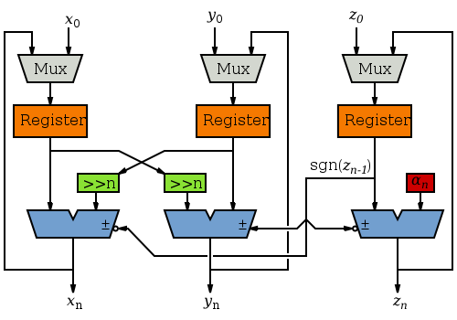

CORDIC Engine
=============

Implementation of 
[CORDIC](https://en.wikibooks.org/w/index.php?title=Digital_Circuits/CORDIC)
in 
[Amaranth](https://github.com/amaranth-lang/amaranth).

CORDIC (for "coordinate rotation digital computer") is a method of deriving sin() and cos() from an angle. It was first described by Jack E. Volder(1) in his 1959 paper "The CORDIC Trigonometric Computing Technique".

It uses an iterative technique of successive approximation to generate sin and cos outputs. A binary search through different rotations is accumulated until the desired angle is acheived.

The core of the engine is described by the following block diagram :

The initial x0, y0 and z0 values are loaded in. x0 and y0 are the initial sin & cos values. z0 is the desired phase angle in radians. The engine is clocked for a number of iterations, the x and y outputs are the cos and sin of the desired angle.

The table of incremental rotations are shown here as **α**n. These are stored as an Array of constants, indexed by the iteration number. The number of iterations is determined by the **α** table. When the value becomes 0, no further adjustment is possible, so you can stop iterating. The number of iterations is therefore determined by the bit-width, which can be specified.

Two different signed fixed point represtations are used. The Z loop uses radians from 0 to pi/2 so has a range of +1.99 to -1.99. The X and Y loops have a range of +0.999 to -0.999.

The algorithm has a gain of K, so if x0 is loaded with 1.0/K and y0 with 0.0, the output will be scaled to unity gain. I use a helper class for the float/binary conversion, so the actual number used is 2.0/K, but this is interpretted as 1.0/K on the outputs.

The unit can calculate sin/cos in the first quadrant (0 .. 90 degrees).

----

4 quadrant operation
----

In order to operate across all four quadrants, the input and output data need to be modified. This can be acheived as follows :

<table>
    <tr>
        <td>quadrant</td>
        <td>input</td>
        <td>cos</td>
        <td>sin</td>
    </tr>
    <tr>
        <td>0 .. 90</td>
        <td>angle</td>
        <td>x</td>
        <td>y</td>
    </tr>
    <tr>
        <td>90 .. 180</td>
        <td>angle - 90</td>
        <td>-y</td>
        <td>x</td>
    </tr>
    <tr>
        <td>180 .. 270</td>
        <td>angle - 180</td>
        <td>-x</td>
        <td>-y</td>
    </tr>
    <tr>
        <td>270 .. 360</td>
        <td>angle - 270</td>
        <td>y</td>
        <td>-x</td>
    </tr>
</table>

The input needs a conversion from rotation angle to radians, in signed fixed point format. The output needs to apply a correction based on the quadrant. This requires a single multiplier on the input stage to convert to radians by multiplying by pi/2. The output stage needs a pair of multiplexers and signed adders.

The input rotation angle is simply an unsigned binary number, representing an angle from 0 .. 360 degrees. This could be a timer, a counter, data from a shaft encoder etc.

The (angle - xx) is just a mod operation, so you can simply use the top 2 bits for the quadrant and the reset of the bits are the input theta.

----

1. Volder, Jack E. (1959-03-03). "The CORDIC Computing Technique"
